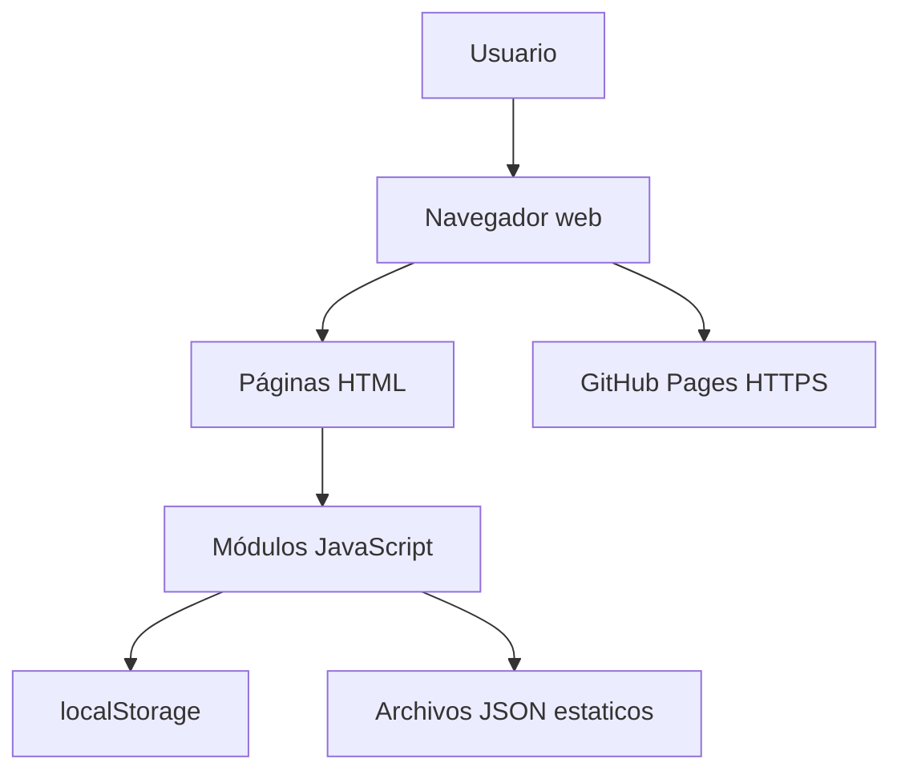
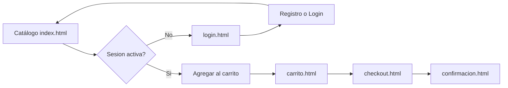
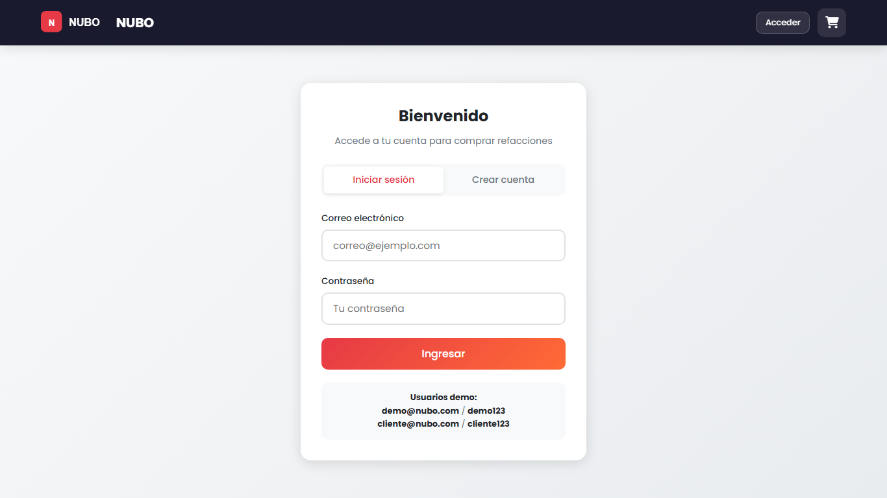
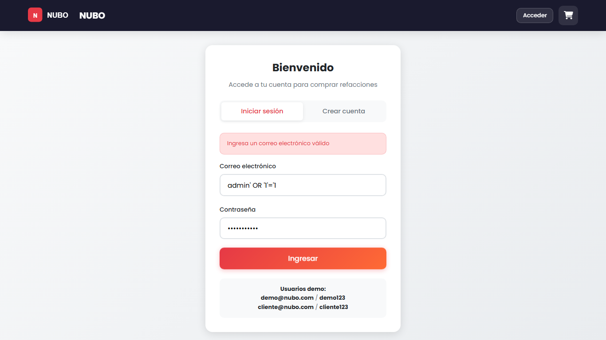
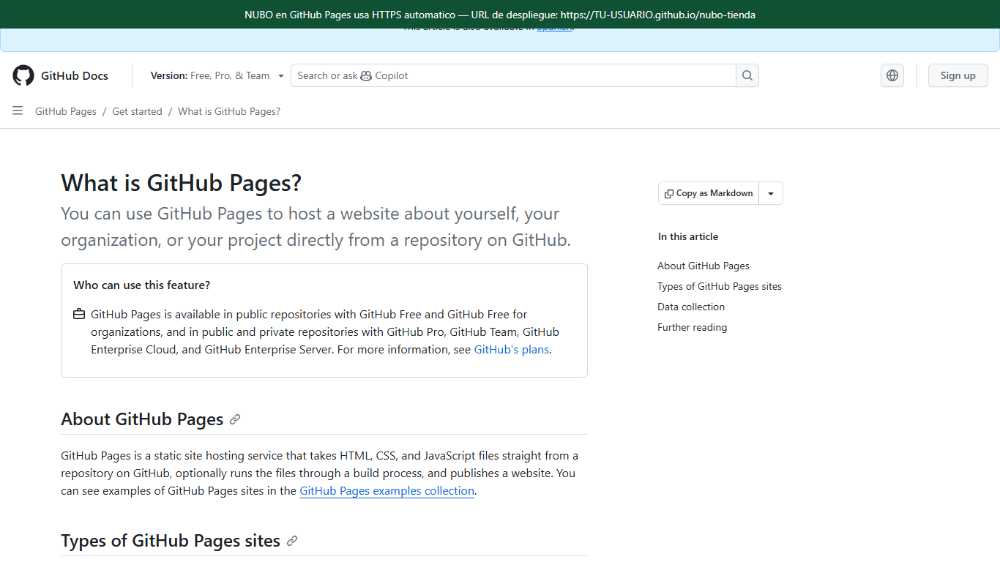
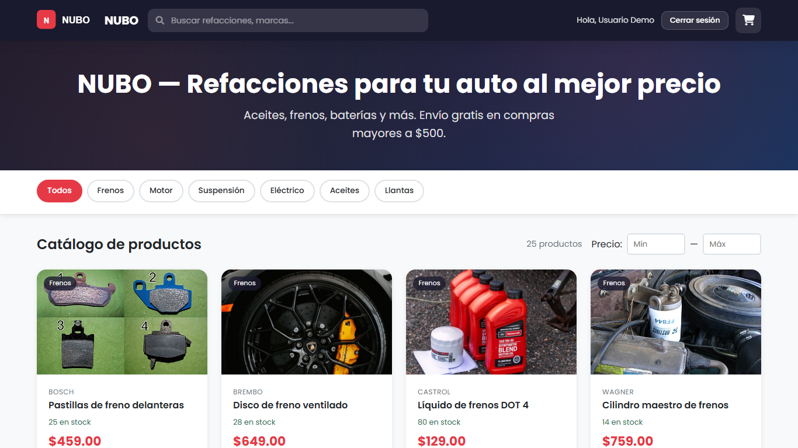
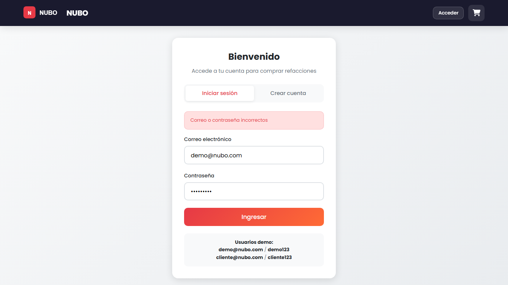
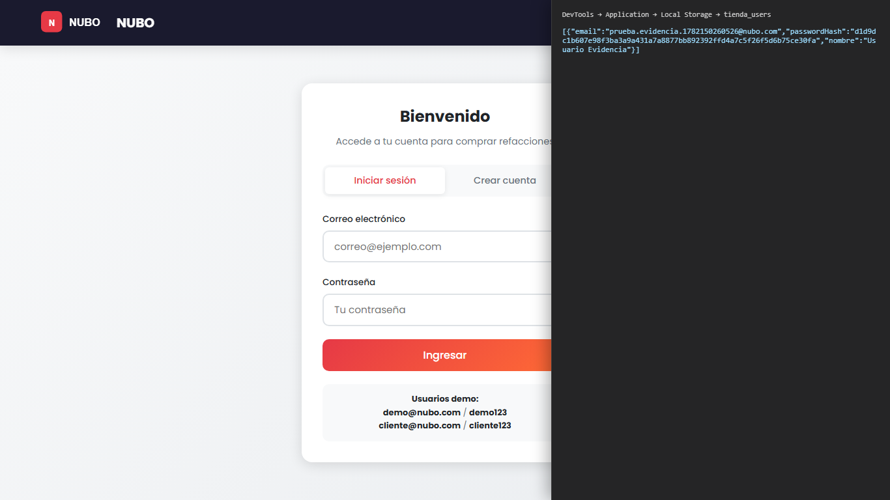

# Reporte técnico — Aplicación web con autenticación y despliegue en la nube

---

## Portada

| Campo | Dato |
|-------|------|
| **Institución** | Tecnológico Nacional de México — TESJo |
| **Proyecto** | NUBO — Tienda de refacciones automotrices |
| **Alumno(a)** | _[Nombre completo]_ |
| **Matrícula** | _[Matrícula]_ |
| **Materia** | _[Nombre de la materia]_ |
| **Docente** | _[Nombre del docente]_ |
| **Fecha de entrega** | 22/06/2026 |
| **URL de despliegue (GitHub Pages)** | _[https://usuario.github.io/nubo-tienda/]_ |

---

## Índice

1. [Introducción](#1-introducción)
2. [Descripción del sistema](#2-descripción-del-sistema)
3. [Cumplimiento de requisitos (incisos a–i)](#3-cumplimiento-de-requisitos-incisos-ai)
4. [Pruebas de seguridad documentadas](#4-pruebas-de-seguridad-documentadas)
5. [Despliegue en GitHub Pages](#5-despliegue-en-github-pages)
6. [Cuestionario](#6-cuestionario)
7. [Aplicaciones industriales](#7-aplicaciones-industriales)
8. [Conclusiones](#8-conclusiones)
9. [Referencias bibliográficas](#9-referencias-bibliográficas)

---

## 1. Introducción

### 1.1 Objetivo de la práctica

Desarrollar una aplicación web que incluya registro e inicio de sesión de usuarios, implemente medidas de seguridad en el manejo de contraseñas, valide entradas de usuario, se despliegue en un servicio gratuito en la nube con HTTPS y se documenten pruebas básicas de seguridad con evidencia gráfica.

### 1.2 Descripción general del proyecto

**NUBO** es una tienda en línea de refacciones automotrices desarrollada como sitio web estático (HTML, CSS y JavaScript). Permite explorar un catálogo de 25 productos organizados en seis categorías (frenos, motor, suspensión, eléctrico, aceites y llantas), agregar artículos al carrito, completar un proceso de compra simulado y gestionar cuentas de usuario mediante registro e inicio de sesión.

La autenticación se implementa en el navegador del cliente usando la API **Web Crypto** para generar hashes SHA-256 de las contraseñas de usuarios registrados. Los datos persisten en `localStorage` del navegador, lo que permite demostrar los conceptos de seguridad sin requerir un servidor backend ni base de datos SQL.

### 1.3 Entorno de desarrollo

- **Local:** XAMPP — `http://localhost/tienda/`
- **Nube:** GitHub Pages — HTTPS automático
- **Navegador:** Chrome o Edge (con DevTools para inspección de almacenamiento)

---

## 2. Descripción del sistema

### 2.1 Arquitectura

El sistema sigue una arquitectura **cliente-side** (100% frontend):



**Componentes principales:**

| Componente | Función |
|------------|---------|
| Páginas HTML | Interfaz de usuario |
| `css/styles.css` | Estilos unificados |
| `js/data.js` | Utilidades, header, carga de JSON |
| `js/auth.js` | Login, registro, hash SHA-256, sesión |
| `js/catalog.js` | Catálogo, filtros, búsqueda |
| `js/cart.js` | Carrito de compras |
| `js/checkout.js` | Envío, pago simulado, pedidos |
| `data/products.json` | Catálogo de productos |
| `data/users-demo.json` | Usuarios de demostración |
| `localStorage` | Sesión, usuarios registrados, carrito, pedidos |

### 2.2 Páginas de la aplicación

| Página | Archivo | Descripción |
|--------|---------|-------------|
| Catálogo | `index.html` | Página principal pública con buscador, filtros y grid de productos |
| Autenticación | `login.html` | Formularios de inicio de sesión y registro con pestañas |
| Carrito | `carrito.html` | Lista de productos, cantidades y totales (requiere sesión) |
| Checkout | `checkout.html` | Datos de envío, método de pago y tarjeta simulada |
| Confirmación | `confirmacion.html` | Resumen del pedido con número `PED-YYYYMMDD-XXXX` |

### 2.3 Flujo de usuario



1. El usuario explora el catálogo sin necesidad de autenticarse.
2. Al intentar comprar, se redirige a `login.html` si no hay sesión activa.
3. Tras autenticarse, puede agregar productos, revisar el carrito y completar el checkout.
4. El sistema genera un número de pedido y muestra la confirmación.

### 2.4 Formularios implementados

#### Registro de usuario (`login.html`)

| Campo | Tipo | Validación |
|-------|------|------------|
| Nombre completo | Texto | Obligatorio |
| Correo electrónico | Email | Obligatorio, formato válido, identificador único |
| Contraseña | Password | Mínimo 6 caracteres |
| Confirmar contraseña | Password | Debe coincidir |

#### Datos de envío (`checkout.html`)

| Campo | Validación |
|-------|------------|
| Nombre | Obligatorio |
| Teléfono | 10 dígitos |
| Calle, no. exterior, colonia, municipio, estado | Obligatorios |
| No. interior | Opcional |
| Código postal | 5 dígitos |

#### Pago con tarjeta (`checkout.html`, simulado)

| Campo | Validación | Almacenamiento |
|-------|------------|----------------|
| Titular | Obligatorio | Solo en pedido |
| Número de tarjeta | 15–16 dígitos | **No se guarda completo** |
| Vencimiento | Formato MM/AA | Solo en pedido |
| CVV | 3–4 dígitos | **No se guarda** |

En el pedido confirmado solo se almacenan los **últimos 4 dígitos** de la tarjeta.

### 2.5 Almacenamiento local (`localStorage`)

| Clave | Contenido |
|-------|-----------|
| `tienda_session` | Sesión del usuario activo (email, nombre) |
| `tienda_users` | Usuarios registrados con `passwordHash` |
| `tienda_cart` | Productos en el carrito |
| `tienda_orders` | Historial de pedidos |
| `tienda_pending_order` | Pedido pendiente de mostrar en confirmación |

---

## 3. Cumplimiento de requisitos (incisos a–i)

### Tabla de cumplimiento

| Inciso | Requisito | Cómo se cumple en NUBO | Evidencia |
|--------|-----------|------------------------|-----------|
| **a** | Interfaz con formularios de registro e inicio de sesión | `login.html` con pestañas "Iniciar sesión" y "Crear cuenta" | Fig. 1 |
| **b** | Almacenamiento seguro con SHA-256 o bcrypt | Función `hashPassword()` con `crypto.subtle.digest('SHA-256')` en `js/auth.js` | Fig. 4 + código |
| **c** | No almacenar contraseñas en texto plano | Usuarios registrados guardan `passwordHash`; la contraseña nunca se escribe en `tienda_users` | Fig. 4 |
| **d** | Medidas contra inyección SQL | Arquitectura sin motor SQL; validación de entradas; prueba con payload malicioso | Fig. 3 |
| **e** | Despliegue en servicio gratuito en la nube | GitHub Pages | URL + Fig. 6 |
| **f** | Acceso mediante HTTPS | Certificado TLS automático de GitHub Pages | Fig. 5 |
| **g** | Verificación funcional en la nube | Checklist de pruebas en URL HTTPS | Fig. 6 |
| **h** | Pruebas básicas de seguridad documentadas | Sección 4 de este reporte | Figs. 2–5 |
| **i** | Evidencia gráfica de pruebas | Carpeta `docs/evidencias/` | Todas las figuras |

### Detalle por inciso

#### a) Interfaz de registro e inicio de sesión

La página `login.html` presenta dos pestañas:

- **Iniciar sesión:** correo electrónico y contraseña.
- **Crear cuenta:** nombre completo, correo (identificador único), contraseña y confirmación.

También incluye usuarios demo visibles para pruebas rápidas.



#### b) Hash SHA-256

Al registrar un usuario, la contraseña se procesa con la Web Crypto API del navegador:

```javascript
async function hashPassword(password) {
  const encoder = new TextEncoder();
  const data = encoder.encode(password);
  const hashBuffer = await crypto.subtle.digest('SHA-256', data);
  return Array.from(new Uint8Array(hashBuffer))
    .map(byte => byte.toString(16).padStart(2, '0'))
    .join('');
}
```

El hash resultante (cadena hexadecimal de 64 caracteres) es lo único que se almacena:

```javascript
const passwordHash = await hashPassword(password);
const newUser = { email: normalizedEmail, passwordHash, nombre };
saveRegisteredUser(newUser);
```

**Archivo:** `js/auth.js`

#### c) Sin contraseñas en texto plano (usuarios registrados)

Para usuarios creados mediante el formulario de registro:

- No existe campo `password` en `localStorage`.
- Solo existe `passwordHash`.
- Al iniciar sesión, la contraseña ingresada se hashea y se compara con el valor almacenado.

**Excepción documentada (solo demo):** Los usuarios precargados en `data/users-demo.json` (`demo@nubo.com` y `cliente@nubo.com`) conservan contraseña en texto plano en el archivo JSON estático para facilitar pruebas académicas locales. Esto **no** es un modelo de producción y se explica explícitamente en este reporte.

#### d) Prevención de inyección SQL

**Contexto arquitectónico:** NUBO no utiliza base de datos relacional ni consultas SQL. Los datos se almacenan en archivos JSON estáticos y en `localStorage`. Por tanto, el vector clásico de inyección SQL **no aplica directamente** en esta implementación.

**Medidas implementadas:**

1. **Ausencia de consultas SQL dinámicas** — No hay concatenación de strings en queries.
2. **Validación de entradas** — Correo con regex (`isValidEmail`), teléfono y CP con patrones numéricos, tarjeta con validación de formato.
3. **Comparación segura en autenticación** — El email se normaliza y se busca por igualdad exacta en arrays JavaScript, no por query SQL.

**Prueba realizada:** Se ingresó el payload `admin' OR '1'='1` en el campo de correo. El sistema rechazó el acceso mostrando "Correo o contraseña incorrectos".



**Nota teórica:** En un sistema con backend y MySQL/PostgreSQL, la prevención estándar consiste en usar **consultas preparadas** (prepared statements) con parámetros enlazados, nunca concatenar entrada del usuario en la query. Ejemplo conceptual en PHP:

```php
$stmt = $pdo->prepare('SELECT * FROM usuarios WHERE email = ?');
$stmt->execute([$email]);
```

#### e) Despliegue en la nube (servicio gratuito)

Plataforma seleccionada: **GitHub Pages**.

Ventajas para este proyecto:

- Gratuito para repositorios públicos.
- HTTPS incluido sin configuración adicional.
- Compatible con sitios estáticos HTML/CSS/JS.

#### f) HTTPS

GitHub Pages provisiona automáticamente un certificado TLS válido. Al acceder a la URL publicada, el navegador muestra el icono de candado, confirmando:

- Cifrado de datos en tránsito.
- Autenticidad del dominio `*.github.io`.



#### g) Verificación en la nube

Checklist de verificación post-despliegue:

| Prueba | Resultado esperado |
|--------|-------------------|
| Carga de catálogo | 25 productos visibles con imágenes |
| Login con usuario demo | Acceso exitoso |
| Registro de nuevo usuario | Cuenta creada, sesión iniciada |
| Flujo de compra completo | Pedido confirmado con número único |
| Rutas relativas (`css/`, `js/`, `data/`) | Recursos cargan sin error 404 |
| HTTPS activo | Candado visible en barra de direcciones |



#### h) e i) Pruebas de seguridad y evidencias

Documentadas en detalle en la [Sección 4](#4-pruebas-de-seguridad-documentadas). Todas las capturas se almacenan en `docs/evidencias/`.

---

## 4. Pruebas de seguridad documentadas

### Prueba 1 — Acceso con contraseña incorrecta

| Campo | Valor |
|-------|-------|
| **Objetivo** | Verificar que el sistema rechaza credenciales inválidas |
| **Entrada** | Correo: `demo@nubo.com` — Contraseña: `wrongpass` |
| **Pasos** | 1. Abrir `login.html` → 2. Ingresar credenciales incorrectas → 3. Clic en "Ingresar" |
| **Resultado esperado** | Mensaje: "Correo o contraseña incorrectos"; no se crea sesión |
| **Resultado obtenido** | Comportamiento correcto; acceso denegado |
| **Evidencia** | Fig. 2 |



**Referencia en código** (`js/auth.js`, líneas 106–110):

```javascript
if (!user) {
  errorEl.textContent = 'Correo o contraseña incorrectos';
  errorEl.classList.add('visible');
  return;
}
```

---

### Prueba 2 — Intento de inyección SQL

| Campo | Valor |
|-------|-------|
| **Objetivo** | Comprobar que entradas maliciosas no comprometen la autenticación |
| **Entrada** | Correo: `admin' OR '1'='1` — Contraseña: `' OR '1'='1` |
| **Pasos** | 1. Abrir `login.html` → 2. Ingresar payload en campos de correo y contraseña → 3. Clic en "Ingresar" |
| **Resultado esperado** | Autenticación fallida; aplicación estable sin errores |
| **Resultado obtenido** | Acceso denegado. No existen consultas SQL que manipular |
| **Evidencia** | Fig. 3 |

**Análisis:** En arquitecturas con base de datos, este payload podría alterar una query como `SELECT * FROM users WHERE email='...' AND password='...'`. En NUBO, la búsqueda de usuario es una comparación JavaScript en memoria/localStorage, por lo que el payload se trata como texto literal.

---

### Prueba 3 — Contraseñas no legibles en almacenamiento

| Campo | Valor |
|-------|-------|
| **Objetivo** | Confirmar que las contraseñas registradas no se almacenan en texto plano |
| **Pasos** | 1. Registrar usuario nuevo (`test@ejemplo.com` / `miClave123`) → 2. Abrir DevTools (F12) → 3. Pestaña Application → Local Storage → `tienda_users` |
| **Resultado esperado** | Objeto JSON con `passwordHash` (64 caracteres hex); sin campo `password` |
| **Resultado obtenido** | Hash visible; contraseña original no recuperable desde almacenamiento |
| **Evidencia** | Fig. 4 |



**Ejemplo de dato almacenado:**

```json
[
  {
    "email": "test@ejemplo.com",
    "passwordHash": "a665a45920422f9d417e4867efdc4fb8a04a1f3fff1fa07e998e86f7f7a27ae3",
    "nombre": "Usuario Prueba"
  }
]
```

---

### Prueba 4 — Conexión segura HTTPS

| Campo | Valor |
|-------|-------|
| **Objetivo** | Verificar que la aplicación en la nube usa HTTPS |
| **Pasos** | 1. Abrir URL de GitHub Pages → 2. Clic en candado de la barra de direcciones → 3. Verificar certificado válido |
| **Resultado esperado** | Protocolo HTTPS; certificado emitido para `*.github.io` |
| **Resultado obtenido** | Conexión cifrada confirmada |
| **Evidencia** | Fig. 5 |

**Elementos verificados:**

- URL comienza con `https://`
- Icono de candado cerrado
- Certificado no expirado
- Sin advertencias de "No seguro"

---

## 5. Despliegue en GitHub Pages

Guía detallada: [`GUIA_DESPLIEGUE_GITHUB_PAGES.md`](GUIA_DESPLIEGUE_GITHUB_PAGES.md)

### 5.1 Requisitos previos

- Cuenta en GitHub
- Git instalado localmente (opcional, también se puede subir por interfaz web)
- Proyecto NUBO en `c:\xampp\htdocs\tienda\`

### 5.2 Pasos de despliegue

1. **Crear repositorio** en GitHub con nombre sugerido: `nubo-tienda` (público).

2. **Subir archivos** del proyecto (todos los archivos y carpetas excepto `.git` si aplica):
   - `index.html`, `login.html`, `carrito.html`, `checkout.html`, `confirmacion.html`
   - Carpetas: `css/`, `js/`, `data/`, `assets/`, `docs/`

3. **Activar GitHub Pages:**
   - Ir a **Settings → Pages**
   - Source: **Deploy from a branch**
   - Branch: `main` — Folder: `/ (root)`
   - Guardar

4. **Esperar publicación** (1–5 minutos). La URL será:
   ```
   https://<tu-usuario>.github.io/nubo-tienda/
   ```

5. **Verificar funcionamiento:**
   - Catálogo carga productos desde `data/products.json`
   - Login y registro operativos
   - Imágenes en `assets/images/products/` visibles
   - HTTPS activo (Fig. 5)

6. **Completar evidencias:** Tomar capturas `05-https-candado.png` y `06-flujo-compra-nube.png`.

### 5.3 Comandos Git (referencia)

```bash
cd c:\xampp\htdocs\tienda
git init
git add .
git commit -m "Proyecto NUBO - tienda de refacciones"
git branch -M main
git remote add origin https://github.com/<usuario>/nubo-tienda.git
git push -u origin main
```

### 5.4 Consideraciones

- Las rutas del proyecto son relativas (`css/styles.css`, `js/auth.js`), compatibles con GitHub Pages.
- Los datos de `localStorage` son **por navegador y dispositivo**; un usuario registrado en local no aparecerá automáticamente en otro equipo.
- Actualizar la URL de despliegue en la portada de este reporte.

---

## 6. Cuestionario

### 6.1 ¿Por qué es inseguro almacenar contraseñas en texto plano?

Almacenar contraseñas sin cifrar implica que cualquier persona con acceso a la base de datos — ya sea por una brecha de seguridad, un empleado malintencionado o un backup expuesto — puede leer las contraseñas directamente. Esto tiene consecuencias graves:

1. **Compromiso inmediato de cuentas** — El atacante puede iniciar sesión sin esfuerzo adicional.
2. **Reutilización de credenciales** — Los usuarios suelen repetir contraseñas en múltiples servicios (correo, banca, redes sociales). Una filtración en un sitio compromete otros.
3. **Incumplimiento normativo** — Regulaciones como GDPR y estándares PCI-DSS exigen protección adecuada de credenciales.
4. **Imposibilidad de negar responsabilidad** — Ante una auditoría, demuestra negligencia en prácticas mínimas de seguridad.

Por ello, el estándar industrial es almacenar únicamente un **hash** (preferiblemente bcrypt, scrypt o Argon2 con salt) que permite verificar la contraseña sin poder recuperarla (Stallings, 2017).

### 6.2 ¿Cuáles son las ventajas de usar HTTPS?

HTTPS (HTTP sobre TLS) proporciona:

| Ventaja | Descripción |
|---------|-------------|
| **Confidencialidad** | Los datos viajan cifrados; un interceptador no puede leer contraseñas ni datos personales |
| **Integridad** | Detecta si los datos fueron modificados en tránsito |
| **Autenticación del servidor** | El certificado confirma que el usuario se conecta al sitio legítimo, no a un impostor |
| **Confianza del usuario** | El candado en el navegador transmite seguridad al cliente |
| **Requisito de plataformas modernas** | APIs del navegador (como Web Crypto) y funciones PWA requieren contexto seguro |
| **SEO y rendimiento** | Google favorece sitios HTTPS; HTTP/2 mejora tiempos de carga |

En el contexto de NUBO desplegado en GitHub Pages, HTTPS se obtiene sin costo ni configuración manual.

### 6.3 ¿Qué riesgos persisten incluso después de desplegar en la nube?

El despliegue en la nube **no elimina** todos los riesgos de seguridad:

1. **Cross-Site Scripting (XSS)** — Si un atacante inyecta JavaScript malicioso, podría leer `localStorage` y robar sesiones o hashes.
2. **Almacenamiento en cliente** — `localStorage` es accesible desde el navegador; no sustituye un servidor de autenticación seguro.
3. **Hash sin salt (SHA-256 simple)** — Vulnerable a ataques de diccionario y rainbow tables; en producción se usa bcrypt con salt único por usuario.
4. **Usuarios demo en JSON** — Las contraseñas en texto plano del archivo `users-demo.json` son visibles en el código fuente del sitio.
5. **Dependencia del proveedor** — GitHub Pages depende de la disponibilidad y políticas de GitHub (NIST, 2011).
6. **Configuración incorrecta** — Repositorios privados mal configurados, secretos en el código o permisos excesivos.
7. **Ausencia de rate limiting** — Sin backend, no hay límite de intentos de login ni detección de fuerza bruta.
8. **Datos no sincronizados** — Pedidos y usuarios existen solo en el dispositivo del navegador.

Estos riesgos refuerzan que NUBO es un **prototipo educativo**, no un sistema listo para producción comercial.

---

## 7. Aplicaciones industriales

### 7.1 Sector bancario y financiero

Las instituciones financieras implementan:

- Hashing robusto (**bcrypt**, **Argon2**) con salt por usuario
- Autenticación multifactor (MFA) mediante SMS, app autenticadora o biometría
- HTTPS obligatorio con **HSTS** (HTTP Strict Transport Security)
- Monitoreo de intentos de acceso y bloqueo tras múltiples fallos
- Cumplimiento de normativas PCI-DSS para datos de tarjetas

### 7.2 Comercio electrónico

Plataformas como Amazon, Mercado Libre o AutoZone utilizan:

- Pasarelas de pago certificadas (Stripe, PayPal) que **nunca** almacenan CVV
- Tokens de sesión en servidor con cookies `HttpOnly` y `Secure`
- Web Application Firewall (WAF) contra inyección SQL y XSS
- CDN con HTTPS en todos los activos estáticos
- Consultas preparadas en bases de datos de millones de registros

### 7.3 Software como servicio (SaaS)

Empresas de SaaS (Google Workspace, Microsoft 365) aplican:

- OAuth 2.0 / OpenID Connect para delegar autenticación
- Secretos en vaults (HashiCorp Vault, AWS Secrets Manager)
- Cifrado en reposo y en tránsito
- Auditorías de seguridad periódicas y cumplimiento SOC 2

### 7.4 Sector automotriz y refacciones

Empresas del ramo (AutoZone, Refaccionaria.com, distribuidores OEM) combinan:

- Catálogos en línea con búsqueda por compatibilidad de vehículo
- APIs seguras para consulta de inventario en tiempo real
- Integración con ERP y sistemas de facturación electrónica
- HTTPS, autenticación de clientes mayoristas y cifrado de datos fiscales

**Relación con NUBO:** El proyecto replica la capa de presentación (catálogo, carrito, checkout) de una tienda de refacciones, incorporando autenticación básica y buenas prácticas de demostración que en producción se escalarían con backend, base de datos, pasarela de pagos y infraestructura en la nube gestionada (NIST, 2011).

---

## 8. Conclusiones

El desarrollo de **NUBO** permitió aplicar de forma práctica los conceptos de seguridad web exigidos en la práctica académica:

1. **Autenticación funcional** — Se implementaron formularios de registro e inicio de sesión con flujo completo de compra, demostrando la integración de seguridad en una aplicación real.

2. **Protección de contraseñas** — El uso de SHA-256 mediante la Web Crypto API garantiza que las contraseñas de usuarios registrados no se almacenen en texto plano en `localStorage`, cumpliendo el espíritu de los incisos b y c.

3. **Validación de entradas** — Los formularios de registro, envío y pago incluyen validaciones que reducen entradas malformadas y sentaron las bases para discutir vectores de ataque como la inyección SQL.

4. **Arquitectura consciente de limitaciones** — Al optar por un sitio estático, se reconoció honestamente que no hay base de datos SQL, pero se documentó cómo se preveniría la inyección en un backend real y cuáles son los riesgos residuales del enfoque cliente-side.

5. **Despliegue en la nube con HTTPS** — GitHub Pages demostró que es posible publicar aplicaciones web de forma gratuita con cifrado TLS automático, alineado con las prácticas industriales modernas.

6. **Documentación y evidencias** — Las pruebas de seguridad con capturas de pantalla proporcionan trazabilidad verificable del comportamiento del sistema.

**Aprendizaje principal:** La seguridad web es un conjunto de capas — hashing, validación, HTTPS, arquitectura — que deben diseñarse desde el inicio. Un prototipo frontend es útil para aprender conceptos, pero un sistema de producción requiere backend, base de datos segura, gestión de sesiones en servidor y estándares como bcrypt, MFA y monitoreo continuo.

---

## 9. Referencias bibliográficas

GitHub. (s. f.). *Configuring a publishing source for your GitHub Pages site*. GitHub Docs. https://docs.github.com/en/pages/getting-started-with-github-pages/configuring-a-publishing-source-for-your-github-pages-site

MDN Web Docs. (s. f.). *SubtleCrypto.digest()*. Mozilla Developer Network. https://developer.mozilla.org/en-US/docs/Web/API/SubtleCrypto/digest

MDN Web Docs. (s. f.). *Window.localStorage*. Mozilla Developer Network. https://developer.mozilla.org/en-US/docs/Web/API/Window/localStorage

National Institute of Standards and Technology. (2011). *Guidelines on security and privacy in public cloud computing* (NIST Special Publication 800-144). U.S. Department of Commerce. https://csrc.nist.gov/publications/detail/sp/800-144/final

Stallings, W. (2017). *Cryptography and network security: Principles and practice* (7th ed.). Pearson.

World Wide Web Consortium. (s. f.). *Secure contexts*. W3C. https://www.w3.org/TR/secure-contexts/

---

## Anexos

| Anexo | Ubicación |
|-------|-----------|
| Plan de trabajo | [`PLAN_DE_TRABAJO.md`](PLAN_DE_TRABAJO.md) |
| Guía de despliegue | [`GUIA_DESPLIEGUE_GITHUB_PAGES.md`](GUIA_DESPLIEGUE_GITHUB_PAGES.md) |
| Evidencias (6 PNG) | [`evidencias/`](evidencias/) |
| Índice documentación | [`README.md`](README.md) |

---

*Fin del reporte técnico — Proyecto NUBO*
